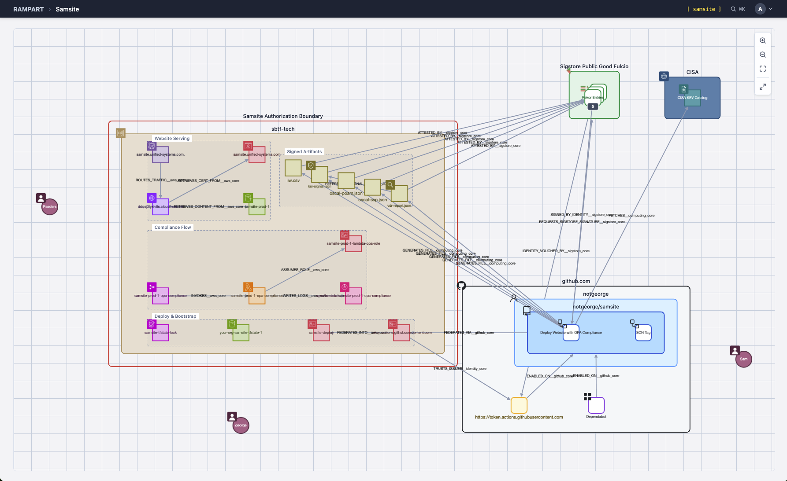
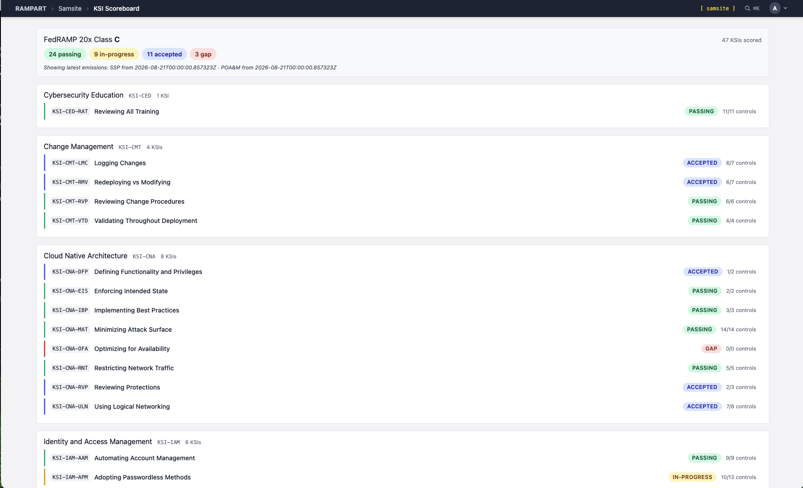
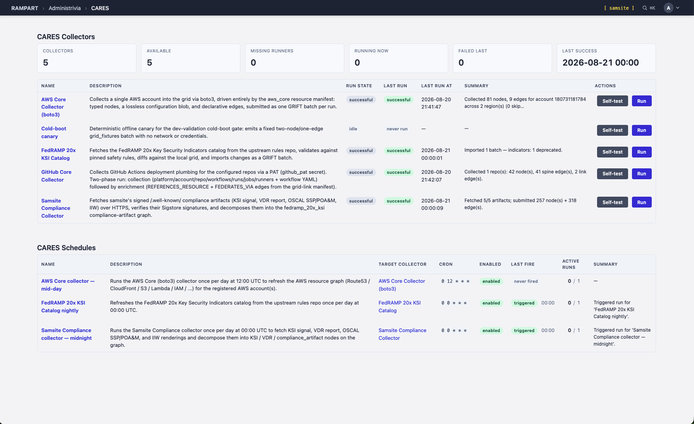

# Samsite plugin



This is a real deployment's authorization boundary, rendered as a living graph —
collected from the running system, not drawn. Every authorization package has a
boundary diagram; most are drawn once and stale by the next sprint. This one is
generated from what is actually deployed. The red boundary encloses the AWS
resources the collector found in the account — the CloudFront/Route 53/S3 serving
path, the Lambda that runs OPA compliance checks and the IAM role it assumes, the
Terraform state locks from bootstrap. Around it sit the systems your security
program actually depends on but rarely draws: the GitHub repository and Actions
workflow that deploys the site, the Sigstore transparency-log entries attesting
every signed compliance artifact, and CISA's Known Exploited Vulnerabilities
catalog — on the same graph as the inventory it applies to.

The edges are typed facts, not arrows: `ROUTES_TRAFFIC`, `ASSUMES_ROLE`,
`ATTESTED_BY`, `FEDERATES_VIA`. "What talks to what, and who vouches for it" becomes
a query you can run, not an interview you have to schedule.

Samsite is TAP's reference assessment target: a real, deployed website whose AWS
infrastructure, GitHub build/deploy pipeline, and signed `/.well-known/` compliance
artifacts are all pulled onto the grid so Rampart can assess it end to end. It is a
cross-deployment of Sam Aydlette's [samaydlette.com](https://github.com/sam-aydlette/samaydlette.com),
whose Terraform is a FedRAMP 20x compliance overlay — which is what makes it a
genuine 20x target rather than a demo fixture.

**Samsite is a projection/pages plugin.** It owns:

- the landing page that projects the deployment as a Cytoscape graph,
- the compliance pages (KSI scoreboard, OSCAL POA&M, IIW inventory, VDR report),
- the per-type viewer pages,
- the compliance collector that fetches and sigstore-verifies the signed
  `/.well-known/` artifacts,
- the collector schedules.

It does **not** own AWS resource models, AWS edges, or the boto3 collector — those
live in [`aws_core`](https://github.com/unified-systems-com/tap-plugin-aws-core). It does not own the
KSI catalog either; that is `fedramp_20x_ksi`.

**Samsite is TAP's testing / demo configuration.** The `samsite` boot profile is the
full-stack exercise: it installs eleven plugins, seeds their pages and schedules, then
fires four collectors that pull a real deployment onto the grid. If you want to see
everything TAP does in one boot — or verify that a change didn't break the end-to-end
path — this is the profile to stand up. That also means it has the most preconditions
of any profile, which the next section names explicitly.

---

## What it looks like

Two more screens from the same live instance, alongside the boundary graph above.
Everything in them is collected data — nothing is a mockup, and nothing was typed in
by hand. If your team is staring at FedRAMP 20x and asking "what is continuous,
machine-readable assessment actually supposed to look like?", this is one concrete
answer, small enough to read end to end.

### The 20x scoreboard: 47 KSIs, scored from signed emissions



FedRAMP 20x replaces the narrative SSP with Key Security Indicators, and the question
every compliance team is quietly asking is what reporting against them looks like in
practice. Like this: 47 KSIs scored from the deployment's own signed, machine-readable
emissions — the SSP and POA&M fetched from the live site that same day, timestamped at
the top of the page. Rolled up by capability family, each row carries one of four
states, kept honestly distinct: **passing** (validated by evidence), **in-progress**,
**accepted** (a risk someone signed their name to, visible rather than buried), and
**gap**. When an assessor asks how you're doing on `KSI-CNA-MAT`, the answer is a row
reading 14/14 controls with a date — not a week of document archaeology.

### Evidence collection as a system, not a fire drill



The two screens above are only as good as their inputs, so the inputs are first-class
and inspectable. Five collectors, each with a run state, a timestamp, and a one-line
result you can hold it to: the AWS collector refreshes the resource graph daily; the
FedRAMP KSI catalog re-pulls nightly, so an indicator deprecated upstream shows up as
a diff the next morning instead of a surprise at assessment; and the site's own
compliance artifacts — KSI signal, the VDR vulnerability report, OSCAL SSP and POA&M,
the integrity inventory — are fetched over HTTPS and their Sigstore signatures
**verified before a single node lands on the graph**. Every fact on the previous two
screens has the same answer to "where did this come from, and when."

That loop — machine-readable artifacts, cryptographic provenance, scheduled
collection, continuous scoring — is the thing 20x and modern vulnerability management
are both asking for. The rest of this README is the operator's guide to standing it
up against your own deployment.

---

## The fast path

From a bare machine (macOS or a Linux desktop with Docker) to the reference
deployment on the grid:

```bash
mkdir -p ~/tap-sessions
git clone git@github.com:unified-systems-com/tap.git ~/tap-sessions/main
cd ~/tap-sessions/main
scripts/spawn-session.sh sam --from git+https://github.com/unified-systems-com/tap-plugin-samsite@v0.2.3#samsite
```

The boot profile ships **inside this plugin** as an in-package boot record — the
`--from` pointer fetches it straight from this repository, so the tap clone
carries nothing samsite-specific. `@v0.2.3` pins the current release (immutable,
digest-verified); substitute `@main` to float with this repo's latest. The spawn
script checks your host itself (toolchain, layout — it tells you the fix for
anything missing), pulls the published images (no local compile), and boots the
record. **You do not need to get the credential setup right
before running it**: the profile *declares* every secret it requires
(`required_secrets`), and the boot preflight checks the declarations in seconds —
before anything expensive runs — naming exactly what is missing, what kind it
must be, and what it should be allowed to do. The failure output is the setup
guide. With an AI assistant attached to the session worktree (spawn wires the
skill farm there before boot runs, and prints the attach command when it
finishes — or fails), `/provision-secrets` reads that same declaration and walks
you from each gap to a working credential; the sections below are the canonical
per-credential references it routes to.

When something fails, the evidence is durable: `logs/boot/latest.boot-record.json`
in the session worktree records which check failed and why — a *missing* secret
(provision it) reads differently from a *present-but-dead* one (rotate it) — and
the `/diagnose-failed-session-spawn` skill reads that record first.

## Before you boot: the configuration checklist

This table is the human summary of what the profile **declares machine-readably**
in its `required_secrets` section — the boot preflight enforces it, so you never
have to reconstruct this from prose: a gap fails the boot in seconds, before any
seeding or collection, with the exact `scope:key`, expected kind, and
least-privilege note. Rows are still worth reading before your first boot:

| # | Requirement | Consumed by | If absent / stale |
| --- | --- | --- | --- |
| 1 | AWS credential envelope at `$TAP_SECRETS_ROOT/aws_core/boto_collector.secret.json` (Step 1) | `aws_core:boto3` | preflight offline lane: `required secret aws_core:boto_collector missing` (or kind mismatch) — before anything runs |
| 2 | Region scope on that envelope (Step 2) | `aws_core:boto3` | the run fails visibly — no implicit default |
| 3 | GitHub PAT envelope at `$TAP_SECRETS_ROOT/github_core/collector.secret.json`, with a **live** token (Step 3) | `github_core:github_core` | missing → preflight offline lane names it; present-but-dead → the live self-test lane isolates it (401 on `/rate_limit`) — the two failures read differently on purpose |
| 4 | Outbound HTTPS to your deployed site, `cisa.gov`, and the FedRAMP catalog host | `samsite:samsite-compliance`, `fedramp_20x_ksi:ksi-catalog` | the preflight's live self-test lane fails the collector — still before any seeding |
| 5 | `artifact_manifest.json` pointing at *your* deployment (Step 4) — reference values only work for the reference site | `samsite:samsite-compliance` | artifact fetches 404 or verify against the wrong signing repo |

Two failure modes worth naming because they have bitten:

- **Credential rotation is not self-healing.** The envelopes hold copies. Revoking a
  PAT or rotating an AWS key on the provider side leaves a dead credential in
  `TAP_SECRETS_ROOT` that passes the load-time secrets check (it still parses; the
  loader cannot know it was revoked without a network call) and then aborts the boot
  at collector-fire time. When you revoke credentials anywhere, sweep the envelopes
  in the same sitting.
- **The evidence is durable now.** Beyond the terminal output, every boot writes a
  machine-readable record to `logs/boot/latest.boot-record.json` in the worktree —
  phases, per-check status, and on failure the failing checks with their provider
  error detail. Read it instead of re-running boot.

## Running samsite against your own deployment

Samsite pulls from a **live** system. There is no bundled snapshot, so the plugin is
only useful pointed at a deployment you control. This section is the preparation
checklist.

### What you need before you start

1. **Your own samsite deployment.** Fork the upstream site repo, deploy it into your
   own AWS account behind your own domain, and let its CI publish the signed
   `/.well-known/` artifacts. The compliance collector fetches five of them —
   `ksi-signal.json`, `vdr-report.json`, `oscal-ssp.json`, `oscal-poam.json`, `iiw.csv`
   — each alongside a `.bundle` sigstore signature. The full list, with what each one
   decomposes into, is declarative in
   `tap_plugin/samsite/collectors/compliance_collector/artifact_manifest.json`.
2. **An AWS principal that can read that account.** Read-only. See below.
3. **A GitHub token that can read the signing repo** — the repo whose Actions
   workflow signs the artifacts. See Step 3.
4. **A TAP instance** with the `samsite` boot profile's plugin set installed.

### Step 1 — Place the AWS credential

> This section is the canonical `aws_static_access_key` / `aws_assumed_role` reference the `/provision-secrets` skill routes to.

The boto3 collector never reads credential files directly; credentials resolve through
the `tap_cares` secrets subsystem. Drop one envelope under your `TAP_SECRETS_ROOT`:

```
$TAP_SECRETS_ROOT/aws_core/boto_collector.secret.json
```

The path is not free-form. The collector resolves a fixed reference — scope `aws_core`,
key `boto_collector` — and **the filename must match the envelope's `key`**. Scope names
the plugin that *consumes* the credential, not the provider that issued it.

For a deployment in **your own account**, use the `aws_static_access_key` kind:

```json
{
  "scope": "aws_core",
  "key": "boto_collector",
  "kind": "aws_static_access_key",
  "description": "Read-only AWS credentials for the boto3 collector against my samsite deployment.",
  "data": {
    "access_key_id": "<your-access-key-id>",
    "secret_access_key": "<your-secret-access-key>",
    "regions_allowed": ["us-east-1", "us-east-2"]
  }
}
```

`session_token` is accepted if you are using temporary credentials. The `data` block is
strict — `additionalProperties` is false, so anything not in the schema is rejected at
resolution rather than ignored.

If instead you are collecting from an account you do **not** own, use the
`aws_assumed_role` kind and follow `aws_core`'s cross-account handoff kit at
`tap_plugin/aws_core/collectors/boto3_collector/handoff/` — it ships a CloudFormation
template, a Terraform equivalent, and the operator-side principal policy. That path
requires an External ID and never moves long-lived keys across the account boundary.

**Least privilege.** The collector reads ACM, CloudFront, DynamoDB, EventBridge, IAM,
Lambda, CloudWatch Logs, Route 53, S3 and STS. AWS's managed `SecurityAudit` policy
covers this — read-only configuration metadata with no data-plane object reads — and is
what the cross-account role template attaches. Do not give the collector write
permissions; it never writes.

### Step 2 — Scope the regions

Region scope is operator-owned and lives on the secret, for both kinds:

- `regions_allowed` — a non-empty list; regional collection is confined to exactly these.
- `region` — a single region, used when `regions_allowed` is absent.
- **Neither: the run fails visibly.** This is deliberate; there is no implicit default.

The reference deployment spans `us-east-1` and `us-east-2` (CloudFront and ACM
certificates are us-east-1 by nature). Use whatever your own deployment actually spans —
every extra region is collection time you pay on every run.

### Step 3 — Place the GitHub credential

> This section is the canonical `github_pat` reference the `/provision-secrets` skill routes to.

The `github_core` collector walks the repository whose Actions workflow signs your
artifacts — repo metadata, workflows, runs, jobs, and (permission allowing) runners.
It resolves a fixed reference the same way the AWS collector does: scope
`github_core`, key `collector`, kind `github_pat`:

```
$TAP_SECRETS_ROOT/github_core/collector.secret.json
```

```json
{
  "scope": "github_core",
  "key": "collector",
  "kind": "github_pat",
  "description": "Fine-grained PAT for the github collector against my signing repo.",
  "data": {
    "token": "github_pat_...",
    "repos": ["<owner>/<repo>"]
  }
}
```

`data` is strict: `token` and `repos` are required; `api_base_url` (default
`https://api.github.com`) and `initial_run_limit` (default `10`, the run-history
depth of the first pull) are the only other accepted fields. `repos` entries are
`owner/repo` — for samsite, the repo your deploy workflow lives in.

**Why a token is required at all.** Four reasons, in decreasing order of force:

1. The reference signing repo is **private**, so every endpoint needs an
   authenticated token with access to it. Yours may be public — the next three
   reasons still apply.
2. The `token` field is schema-required; the v0 collector has no anonymous mode.
3. Anonymous GitHub API access is limited to 60 requests/hour; paginating runs and
   jobs would starve. Authenticated is 5,000/hour.
4. The runners endpoint requires elevated repo access even on public repos (the
   collector degrades gracefully on 403 there — you lose runner nodes, nothing else).

**Recommended token:** a fine-grained PAT scoped to only the signing repo, with
read-only **Metadata**, **Contents**, and **Actions** permissions. Add
**Administration (read)** only if you want runner nodes. Fine-grained PATs are bound
to one resource owner — if the repo moves to an organization, the PAT does not
follow; mint a new one under the new owner. Set an expiry you will actually outlive
the demo with, or calendar the rotation: an expired or revoked token aborts the next
boot at `fire-collector:github_core:github_core` with
`GitHub API unreachable or PAT auth failed`.

### Step 4 — Point the compliance collector at your site

`artifact_manifest.json` carries three things that are specific to a deployment:

| Field | Reference value | What yours should be |
| --- | --- | --- |
| `site_base_url` | `https://samsite.unified-systems.com` | your deployed site's origin |
| `verification.github_repository` | `notgeorge/samsite` | the repo whose Actions workflow signs your artifacts |
| `verification.oidc_issuer` | `https://token.actions.githubusercontent.com` | unchanged, if you sign via GitHub Actions |

> **Known limitation.** The manifest is loaded from a path relative to the installed
> module and there is no override — no env var, no boot-profile key, no collector
> config. To point samsite at your own site today you need an **editable** checkout of
> this plugin rather than a pinned git install (the `--dev-plugins` plugin-workspace
> flow; its pairing with `--from`-fetched records is being worked out as part of the
> profile's re-home into this repo). Making this per-install configuration is tracked
> as the next change to this plugin.

The signing identity is *not* hardcoded: `sigstore_link.py` parses whatever SAN URI the
verified certificate carries and resolves it against the grid. Change the manifest's
`github_repository` and verification follows your repo.

### Step 5 — Boot, then fire the collectors in order

The `samsite` boot profile seeds the pages and then fires four collectors. **The order
is load-bearing**, and getting it wrong degrades silently rather than loudly:

1. `aws_core:boto3` — the AWS resource graph (Steps 1–2). Must run **first**: it lands
   the `aws_account` nodes that compliance-boundary membership is synthesized from.
2. `github_core:github_core` — repository and Actions data (Step 3). Must run **before** the
   compliance collector: `sigstore_link` resolves the signing workflow by content-match,
   and if the workflow node is not on the grid yet those `SIGNED_BY_IDENTITY` edges are
   **silently omitted**. You get a graph that looks fine and is missing its provenance
   edges.
3. `fedramp_20x_ksi:ksi-catalog` — the KSI catalog over public HTTPS. No credentials.
4. `samsite:samsite-compliance` — fetches the five artifacts and verifies their sigstore
   bundles.

If the landing graph renders but signing provenance is missing, re-run in this order
before investigating anything else.

---

## What is still pinned to the reference deployment

Named rather than implied, so you know what you are looking at:

- **`artifact_manifest.json`** — site URL and signing repo (Step 4 above). The one
  functional blocker for pointing samsite elsewhere.
- **`samsite-keystone.grift.json`** — the instance keystone describes the reference
  deployment: its site URLs, its owner, and its upstream. Cosmetic, but it is what an AI
  assistant reads to learn what the instance *is*, so it will describe the reference
  system until you edit it.
- **`landing.grift.json`** — two `description` fields mention the reference AWS account
  id. Prose inside seed data; no functional effect.

The account id is **not** hardcoded anywhere functional. The collector resolves it at
runtime via STS `get_caller_identity`, so it lands whatever account your credentials
actually reach.

One asymmetry worth knowing: the `aws_assumed_role` kind accepts an optional
`expected_account_id`, which fails the run closed if the resolved account is not the one
you declared. The `aws_static_access_key` kind has no such field — on the static path
there is no assert-on-land guard, so double-check which account your keys belong to.

## Handling the credential safely

- **Never commit the envelope.** Secret material does not belong in any repository, and
  publication is one-way — a credential in git history is disclosed for the life of the
  repo even after deletion. Keep it under `TAP_SECRETS_ROOT`, outside the tree.
- **The scanner does not cover all of it.** TAP's credential-shape scanner detects AWS
  *access key ids* (`AKIA`/`ASIA` prefixes). It does **not** detect the *secret access
  key* — that has no distinguishing prefix, and entropy heuristics were measured on this
  codebase at 21 findings and 21 false positives, so they are deliberately off. The
  secret access key rests on the envelope layer and `.gitignore`, not on detection.
- **Rotation is restart-to-rotate.** There is no atomic reload; changing a value
  requires restarting the instance.
- **If your `TAP_SECRETS_ROOT` is a shared directory** (it is, in the multi-session dev
  layout), editing an envelope mutates every live session at once. Point
  `TAP_SECRETS_ROOT` at a private directory for experiments.

---

## Specs

Behavior is specified in `specs/`:

- `spec-samsite-compliance-collector-v0.md` — the collector, its manifest, and verification
- `spec-samsite-compliance-pages-v0.md` — the compliance page set
- `spec-samsite-ksi-scoreboard-v0.md` — the KSI scoreboard panel
- `spec-samsite-vdr-ingestion-health-v0.md` — VDR ingestion health
- `spec-samsite-viewer-pages-v0.md` — the per-type viewer pages
